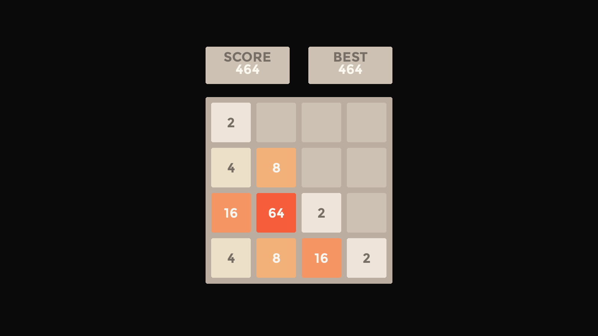

# 2048 AI — Python (Pygame-Based)

A full-screen, visually engaging implementation of the classic 2048 game built using **Python** and **Pygame**, enhanced with an intelligent **AI agent powered by the Expectimax algorithm**. This project features modern UI design, smooth animations, and an offline-ready `.exe` executable for Windows users.

---

## Preview



---

## Features

- Playable offline with a standalone `.exe` for Windows (no Python installation required)
- Modern and responsive user interface with custom fonts and fluid animations
- Integrated AI solver using the Expectimax decision algorithm
- Keyboard-based controls for seamless gameplay
- Smart heuristic evaluations: snake-pattern, monotonicity, and empty-cell prioritization
- Real-time score and high score tracking

---

## AI Logic Overview

The integrated AI utilizes the **Expectimax algorithm** to simulate and evaluate the best move by factoring in both score and future state desirability.

### Key Heuristics Used

- **Snake Pattern Heuristic**: Encourages high-value tiles to be arranged in a flowing, snake-like path
- **Monotonicity Heuristic**: Rewards boards with smoothly increasing or decreasing rows/columns
- **Empty Cells Heuristic**: Prioritizes board states with more available spaces

These heuristics are weighted and combined to influence the AI's move decisions.

---

## Folder Structure


```bash
2048GUI/
├── assets/          # Fonts & high score data
│   ├── highscore.txt
│   ├── montserrat_bold.ttf
│   └── montserrat_regular.ttf
├── dist/            # Windows executable
│   └── main.exe
├── build/           # Build files
├── img/             # Screenshots & images
├── main.py          # Game logic & UI (Pygame)
├── solver.py        # AI (Expectimax algorithm)
├── main.spec        # PyInstaller config
└── README.md        # Documentation
```

---


---

## Getting Started (Local Development)

### Prerequisites

- Python 3.10 or higher
- Pygame

### Installation

Install Pygame using pip:

```bash
pip install pygame
```

### Run Game

```bash
python main.py
```

---

## Run as Standalone `.exe` (No Python Needed)

### Steps:

1. Navigate to `dist/`
2. Double-click `main.exe`
3. Enjoy the full-screen 2048 AI experience on Windows

---

## Game Controls

| Key        | Action                 |
| ---------- | ---------------------- |
| Arrow Keys | Move tiles             |
| `S`        | Toggle AI Auto-Play    |
| `R`        | Restart game           |
| `Q`        | Continue after winning |

---

## How the AI Works (Expectimax)

* AI tries each possible move → evaluates resulting board
* For each tile spawn (2 or 4), it recursively simulates future turns
* Uses `combined_heuristic` to evaluate board potential

Heuristics used:

* `snake_heuristic()`
* `monotonic_heuristic()`
* `free_cells_heuristic()`

You can tweak weights in `solver.py`:

```python
SNAKE_W = 1.0
MONOTONIC_W = 1.0
FREECELLS_W = 2.0
```

---

## Developer Tips

### To Rebuild `.exe`:

Install PyInstaller:

```bash
pip install pyinstaller
```

Then build with:

```bash
pyinstaller --noconfirm --windowed --onefile --add-data "assets;assets" main.py
```

This ensures:

* Window opens without a terminal (no-console)
* Assets like fonts are packaged correctly

---

## Author and Support

**Aaditya Gunjal**

For inquiries, support, or feedback, please contact:- [aadigunjal0975@gmail.com](mailto:aadigunjal0975@gmail.com)
Alternatively, you may open an issue in the project's GitHub repository.

---

## License

All rights reserved. Educational and personal use only. For licensing requests, contact the author.
